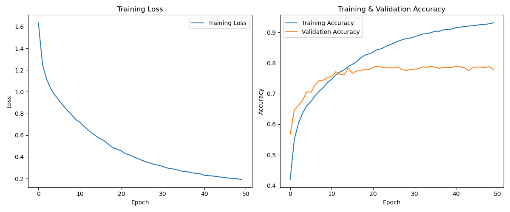
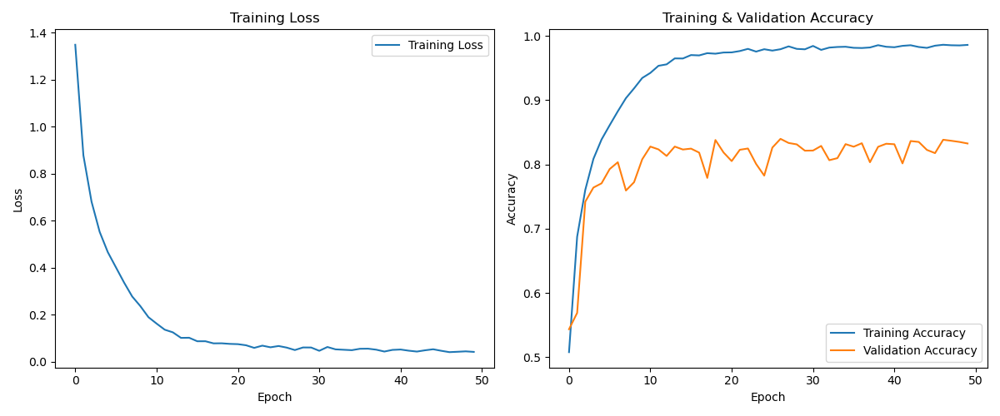

# Project-2 of “Neural Network and Deep Learning”
<center> 陈杨 22307140022 大数据学院
</center>

## 1 Train a network on cifar10
### 数据预处理
***数据增强***：
```python
transform_train = transforms.Compose([
        transforms.RandomCrop(32, padding=4),       # 随机裁剪
        transforms.RandomHorizontalFlip(p=0.5),      # 随机水平翻转
        transforms.ColorJitter(brightness=0.2, contrast=0.2),  # 颜色扰动
        transforms.ToTensor(),
        transforms.Normalize((0.4914, 0.4822, 0.4465), (0.2470, 0.2435, 0.2616)),
    ])
```
### 模型架构示例
#### 1.CustomCNN
##### 特征提取层 (features):​​
***输入层***: 3通道图像（RGB）
***卷积层1***:
64个3×3卷积核
填充保持尺寸不变
可选批归一化（由config.use_bn控制）
ReLU激活
最大池化: 2×2窗口（尺寸减半至16×16）
***卷积层2***:
128个3×3卷积核
填充保持尺寸
可选批归一化
ReLU激活
最大池化: 2×2窗口（尺寸减半至8×8）
##### ​分类器层 (classifier):​​

***展平层***: 将128×8×8特征图展平为8192维向量
***全连接层1***: 8192 → 512维 + ReLU激活
***Dropout层***: 0.5概率随机失活
***输出层***: 512 → 10维（对应10个类别）

#### 2.ResNet (残差网络)
##### 输入预处理:
3×3卷积（64通道）
可选批归一化
ReLU激活
输出尺寸不变（64×32×32）
##### 残差层堆栈:
***Layer1***: 2个残差块（64→64通道，步长1）
***Layer2***: 2个残差块（64→128通道，步长2降采样）
***Layer3***: 2个残差块（128→256通道，步长2降采样）
##### 输出处理:
全局平均池化（256×1×1）
展平为256维向量
全连接层（256→10维）

##### ​残差块结构 (ResidualBlock):​​
***主路径***:
3×3卷积（可选通道变换）
可选批归一化
ReLU激活
3×3卷积（保持通道）
可选批归一化
***捷径连接***:
当输入/输出通道数不匹配或需要降采样时：
1×1卷积调整维度
否则：恒等映射
融合方式: 主路径输出 + 捷径输出 → ReLU激活

### 训练结果示例


上图为customcnn训练过程，下图为resnet，可以发现resnet训练损失下降更快，最后在验证集的准确率也更高
### 测试结果
customcnn（best_model_1）在测试集上的准确率为78.16%，resnet(best_model_2)为83.54%
### 优化策略
默认配置为Adam优化器、交叉熵损失、ReLU激活、通道数为[64,128,256]（ResNet）和[64,128]（CustomCNN）
#### 1.改变神经元数量
CustomCNN通道修改为[96,192]（best_model_3）,其余配置不变，测试集准确率为62.86%，较低，观察发现训练集损失下降慢，可能原因是未调整学习率，更大的模型需要较小的学习率
#### 2.不同损失函数与正则化
尝试了MSE损失，但效果极其不好，MSE损失适用于回归问题，而不是分类问题。
#### 3.不同激活函数
尝试了elu激活函数但效果不佳，测试集准确率仅有44.66%（best_model_5）
#### 4.不同优化器
在原有resnet的基础上尝试了SGD优化器，并调整初始学习率为0.01，并添加学习率调度,在第30和45epoch衰减为原先的0.1倍，效果也不好，测试集准确率为42.22%,可能是由于学习率设置仍然存在问题（best_model_6）
## 2 Batch Normalization
### 单学习率下带与不带BatchNorm训练结果对比
学习率为0.001，可以观察到，带BatchNorm的模型训练效果更好，损失下降更快，且随训练进行，梯度的范数逐步减小。


### 多学习率下的损失景观对比
学习率分别为0.001，0.002，0.0005,0.0001

在训练中后期，可以明显地观察到带BN的模型损失范围更小，而在训练前期，带BN的模型损失范围更大，分析其原因，可能是由于BN初始参数未优化，在之前的梯度范数图中也能看出，在训练前期，带BN的模型梯度范数更大，从而损失波动明显。
[模型权重](https://drive.google.com/drive/folders/11hDXEGATpsUe4_657aebCpprYHhe4nN4?usp=sharing)
[代码文件]()